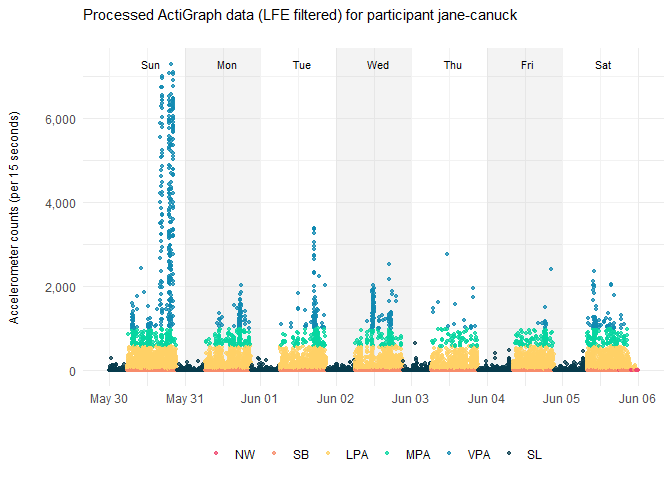

## Overview

**chms** provides tools for cleaning and summarizing accelerometer data
consistent with methods applied to cycle 7 of the
<a href="https://www.statcan.gc.ca/en/survey/household/5071" target="_blank">Canadian
Health Measures Survey</a> (CHMS):

- `agd$new()` initializes an R6 class with fields (data) and methods
  (functions) for processing
  <a href="https://ametris.com" target="_blank">Ametris</a> (formerly
  ActiGraph) accelerometer data.
- `agd$run()` executes a pipeline that calls several methods: `$load()`,
  `$clean()`, `$classify()` and `$summarize()`.
- `agd$sanity_check()` renders an html-formatted report of summary
  statistics per participant.

**chms** requires:

- two ActiGraph (.agd) files per participant, one processed with the
  normal filter (for step counts) and the other processed with the low
  frequency extension filter (for all other movement behaviour
  variables).
- accelerometer data at the 15-second epoch level for participants ≤ 17
  years.
- accelerometer data at the 60-second epoch level or lower for
  participants ≥ 18 years.
- integer age of each participant.

By default, **chms**:

- removes incomplete days of data (\< 24 hours).
- identifies sleep time, wear time and non-wear time by applying the
  <a href="https://www.pbrc.edu/pdf/PBRCSleepEpisodeTimeMacroCode.pdf" target="_blank">Barreira
  algorithm</a> to data at the 60-second epoch level.
- looks for sleep bouts beginning at 6pm (3-5 years) or 7pm (6+ years).
- identifies movement behaviours for eligible epochs (epochs previously
  classified as wear time and awake time) by applying the following
  cut-points to axis1 accelerometer counts at age-specific epoch levels:

| Age (years) | Epoch level (seconds) | SB cut-point (counts) | LPA cut-point (counts) | MPA cut-point (counts) | VPA cut-point (counts) |
|:--:|:--:|:--:|:--:|:--:|:--:|
| 3-4 | 15 | 0-24<sup><a href='https://pubmed.ncbi.nlm.nih.gov/18949660' target='_blank'>Evenson</a></sup> | 25-419<sup><a href='https://pubmed.ncbi.nlm.nih.gov/17135617' target='_blank'>Pate</a></sup> | 420+<sup><a href='https://pubmed.ncbi.nlm.nih.gov/17135617' target='_blank'>Pate</a></sup> | – |
| 5-17 | 15 | 0-24<sup><a href='https://pubmed.ncbi.nlm.nih.gov/18949660' target='_blank'>Evenson</a></sup> | 25-573<sup><a href='https://pubmed.ncbi.nlm.nih.gov/18949660' target='_blank'>Evenson</a></sup> | 574-1,002<sup><a href='https://pubmed.ncbi.nlm.nih.gov/18949660' target='_blank'>Evenson</a></sup> | 1,003+<sup><a href='https://pubmed.ncbi.nlm.nih.gov/18949660' target='_blank'>Evenson</a></sup> |
| 18-64 | 60 | 0-99<sup><a href='https://pubmed.ncbi.nlm.nih.gov/18091006' target='_blank'>Troiano</a></sup> | 100-2,019<sup><a href='https://pubmed.ncbi.nlm.nih.gov/18091006' target='_blank'>Troiano</a></sup> | 2,020-5,998<sup><a href='https://pubmed.ncbi.nlm.nih.gov/18091006' target='_blank'>Troiano</a></sup> | 5,999+<sup><a href='https://pubmed.ncbi.nlm.nih.gov/18091006' target='_blank'>Troiano</a></sup> |
| 65+ | 60 | 0-99<sup><a href='https://pubmed.ncbi.nlm.nih.gov/18091006' target='_blank'>Troiano</a></sup> | 100-2,019<sup><a href='https://pubmed.ncbi.nlm.nih.gov/18091006' target='_blank'>Troiano</a></sup> | 2,020-5,998<sup><a href='https://pubmed.ncbi.nlm.nih.gov/18091006' target='_blank'>Troiano</a></sup> | 5,999+<sup><a href='https://pubmed.ncbi.nlm.nih.gov/18091006' target='_blank'>Troiano</a></sup> |

> **SB:** sedentary behaviour; **LPA:** light-intensity physical
> activity; **MPA:** moderate-intensity physical activity; **VPA:**
> vigorous-intensity physical activity.

- validates days (≥ 10 hours of wear time and ≥ 100 steps). Invalid days
  are excluded from waking hours results.
- validates nights of sleep (≥ 160 minutes of sleep). Invalid nights of
  sleep are excluded from sleeping hours results.

For more details on the methods used in the **chms** R package, see
Clarke J, Gribbon A, St-Laurent M, Ferrao T, Barnes J, Kuzik N, Colley
R.
<a href="https://www150.statcan.gc.ca/n1/pub/82-003-x/2026002/article/00001-eng.htm" target="_blank">Comparison
of physical activity and sedentary time measured with the ActiGraph
GT3X-BT and Actical accelerometers</a>. Health Rep. 2026 Feb
18;37(2):3-15. doi: 10.25318/82-003-x202600200001-eng. PMID: 41730515.

## Installation

``` r
remotes::install_git(
  url = "https://github.com/statcan/chms",
  force = TRUE,
  upgrade = "never"
)
```

## Usage

``` r
# Load dependencies into current R session
library(chms)
library(dplyr)
```

``` r
# Create participant meta (external/non-statcan users)
meta <- tibble(
  id = c("jane-canuck", "john-canuck"),
  age = c(10, 40),
  agd_lfe = c(
    system.file("extdata", "jane-canuck-lfe.agd", package = "chms"),
    system.file("extdata", "john-canuck-lfe.agd", package = "chms")
  ),
  agd_nml = c(
    system.file("extdata", "jane-canuck-nml.agd", package = "chms"),
    system.file("extdata", "john-canuck-nml.agd", package = "chms")
  ),
  start_date = c("2021-05-30", "2021-05-27"),
  epoch_length = c(15, 60)
)

# Print/examine
glimpse(meta)
#> Rows: 2
#> Columns: 6
#> $ id           <chr> "jane-canuck", "john-canuck"
#> $ age          <dbl> 10, 40
#> $ agd_lfe      <chr> "C:/Users/username/AppData/Local/R/win-library/4.4/chms/ex…
#> $ agd_nml      <chr> "C:/Users/username/AppData/Local/R/win-library/4.4/chms/ex…
#> $ start_date   <chr> "2021-05-30", "2021-05-27"
#> $ epoch_length <dbl> 15, 60
```

``` r
# Create participant meta (statcan users)
meta <- get_chms_meta(
  clinic_file = "path/to/clinic/file.sas7bdat",
  agd_dir = "path/to/agd/files/site",
  clinic_id = "CLINICID",
  site = "SITE",
  age = "CLC_AGE",
  day = "V2_DAY",
  month = "V2_MTH",
  year = "V2_YEAR"
)
```

``` r
# Initialize agd R6 class
agd_data <- agd$new(
  id = meta$id,
  age = meta$age,
  agd_lfe = meta$agd_lfe,
  agd_nml = meta$agd_nml,
  epoch_length = meta$epoch_length,
  day_max = 7,
  sleep_algo = "barreira",
  non_wear_algo = "barreira",
  start_date = meta$start_date,
  cpu_max = 8,
  dir = getwd()
)

# Print/examine
agd_data
#> 
#> ── 🍁chms::agd$print() method ──
#> 
#> Settings
#> 
#> # A tibble: 2 × 9
#>   id         age   agd_nml agd_lfe epoch_length day_max sleep_algo non_wear_algo
#>   <chr>      <chr> <chr>   <chr>   <chr>        <chr>   <chr>      <chr>        
#> 1 jane-canu… 10    C:/Use… C:/Use… 15           7       barreira   barreira     
#> 2 john-canu… 40    C:/Use… C:/Use… 60           7       barreira   barreira     
#> # ℹ 1 more variable: start_date <chr>
#> 
#> Log
#> 
#> # A tibble: 1 × 4
#>   method timestamp           status  message
#>   <chr>  <dttm>              <chr>   <chr>  
#> 1 new()  2026-07-27 10:20:38 success ""
```

``` r
# Run processing pipeline (load, clean, classify and summarize data)
agd_data$run()
#> 
#> ── 🍁chms::agd$run() method ──
#> 
#> ℹ Crunching data for 2 participants across 2 CPUs.
#> 
#> ℹ Exporting results to 'C:/Users/username/Desktop/chms/tools/agd-run-2026-07-27-10-20-46-879816'.
#> 
#> ✔ Done!
```

``` r
# Export results manually
agd_data$export(paste0(getwd(), "/my-results"))
#> 
#> ── 🍁chms::agd$export() method ──
#> 
#> ℹ Exporting results to 'C:/Users/username/Desktop/chms/tools/my-results/agd-run-2026-07-27-10-20-47-448933'.
#> 
#> ✔ Done!
```

``` r
# Export statcan-formatted results manually
agd_data$export(getwd(), stc = TRUE)
#> 
#> ── 🍁chms::agd$export() method ──
#> 
#> ℹ Exporting `self$results$summary_full_stc` and `self$results$summary_run` to 'C:/Users/username/Desktop/chms/tools'.
#> 
#> ✔ Done!
```

``` r
# Get settings and pipeline run log
agd_data
#> 
#> ── 🍁chms::agd$print() method ──
#> 
#> Settings
#> 
#> # A tibble: 2 × 9
#>   id         age   agd_nml agd_lfe epoch_length day_max sleep_algo non_wear_algo
#>   <chr>      <chr> <chr>   <chr>   <chr>        <chr>   <chr>      <chr>        
#> 1 jane-canu… 10    C:/Use… C:/Use… 15           7       barreira   barreira     
#> 2 john-canu… 40    C:/Use… C:/Use… 60           7       barreira   barreira     
#> # ℹ 1 more variable: start_date <chr>
#> 
#> Log
#> 
#> # A tibble: 2 × 4
#>   method timestamp           status  message
#>   <chr>  <dttm>              <chr>   <chr>  
#> 1 new()  2026-07-27 10:20:38 success ""     
#> 2 run()  2026-07-27 10:20:47 success ""
```

``` r
# Plot data
plot(agd_data, id = "jane-canuck")
#> 
#> ── 🍁chms::plot(agd) method ──
#> 
#> ℹ Rendering scatter plot for participant `jane-canuck`
```



    #> ✔ Done!

``` r
# Summarize data
summary(agd_data)
#> 
#> ── 🍁chms::summary(agd) method ──
#> 
#> Waking hours summary
#> Participant count: 2
#> 
#> # A tibble: 2 × 14
#>   participant_id device_serial_number wear_time  steps   lpa   mpa   vpa  mvpa
#>   <chr>          <chr>                    <dbl>  <dbl> <dbl> <dbl> <dbl> <dbl>
#> 1 jane-canuck    MOS2E26200432             14.7 10659.  251.  35.5  25.8  61.3
#> 2 john-canuck    MOS2E26200637             16.4 11166.  309.  32.4  17.9  50.3
#> # ℹ 6 more variables: lmvpa <dbl>, mpa_bouts <dbl>, vpa_bouts <dbl>,
#> #   mvpa_bouts <dbl>, sb <dbl>, valid_day <dbl>
#> 
#> Sleeping hours summary
#> Participant count: 2
#> 
#> # A tibble: 2 × 16
#>   participant_id device_serial_number wear_time sleep_period_time sleep_episodes
#>   <chr>          <chr>                    <dbl>             <dbl>          <dbl>
#> 1 jane-canuck    MOS2E26200432             9.32              9.63              1
#> 2 john-canuck    MOS2E26200637             7.28              7.28              1
#> # ℹ 11 more variables: nocturnal_sleep_midpoint <chr>, wake_episodes <dbl>,
#> #   total_wake_episode_time <dbl>, total_sleep_episode_time <dbl>,
#> #   sleep_episode_efficiency <dbl>, total_restful_sleep_time <dbl>,
#> #   sleep_episode_movements <dbl>, total_disrupted_sleep <dbl>,
#> #   restful_sleep_efficiency <dbl>, valid_day <dbl>, sleep_episode_log <chr>
```

``` r
# View all results in tab
agd_data$view()

# View specific results in tab
agd_data$view("summary_full")
agd_data$view("summary_full_stc")
agd_data$view("summary_run")
agd_data$view("summary_sleeping_hours")
agd_data$view("summary_waking_hours")

# View issues and run log
agd_data$view("issues")
agd_data$view("log")
```

``` r
# Store results in stand-alone data frames
summary_full <- agd_data$results$summary_full
summary_full_stc <- agd_data$results$summary_full_stc
summary_run <- agd_data$results$summary_run
summary_sleeping_hours <- agd_data$results$summary_sleeping_hours
summary_waking_hours <- agd_data$results$summary_waking_hours
```

``` r
# Render sanity check report
agd_data$sanity_check(
  name = "My sanity check report",
  dir = getwd()
)
```

## Documentation

``` r
?agd
```
